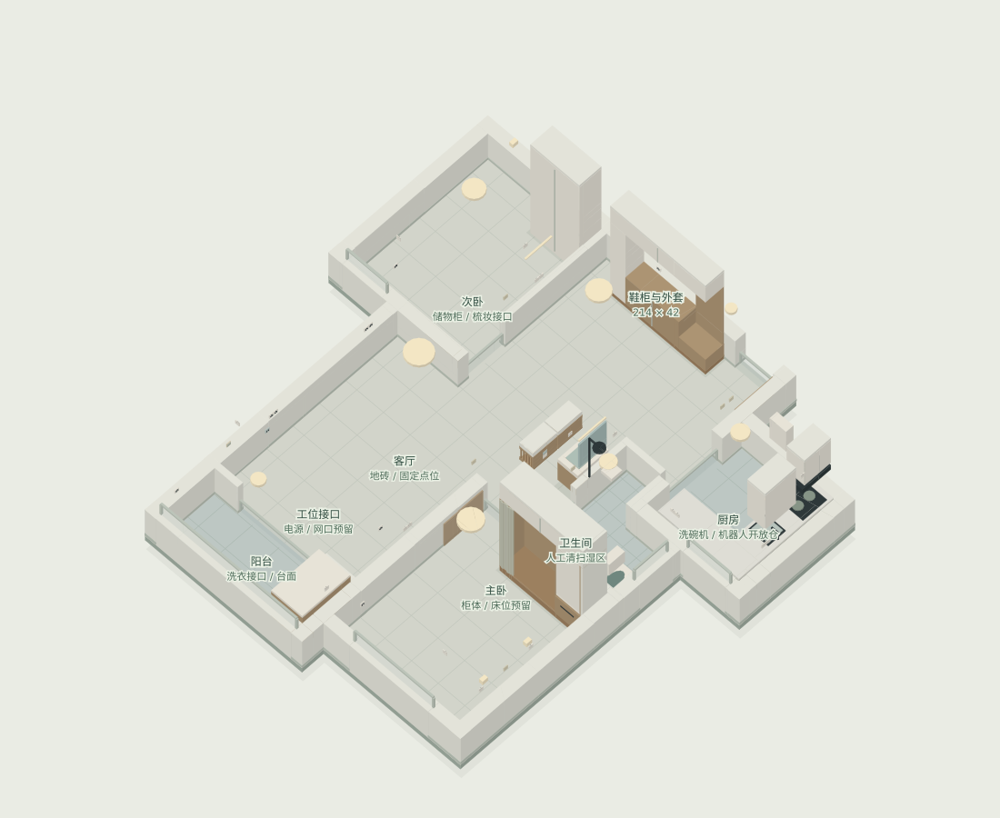
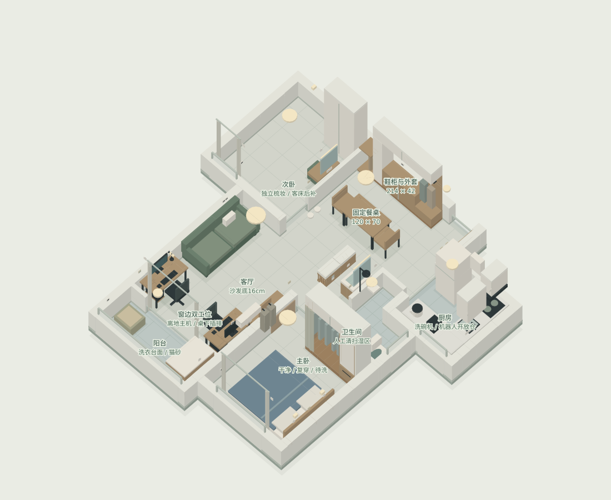

# 装修计划

## 当前交付：V8（2026-10-08）

本轮只需下载同目录的两份文件：[互动装修方案 HTML](交付/装修方案-v8-20261008/装修方案.html) 和 [费用与付款 Excel](交付/装修方案-v8-20261008/装修费用与付款.xlsx)。HTML 下载后可离线打开，包含三维布局、全墙查看、天花灯具、DIY 预留点位、分项预算、购买顺序、报价依据及待确认事项；Excel 用于逐项填写报价和累计付款。GitHub 文件页显示源代码，请选择下载后打开。两份文件的后续编辑独立保存，不会自动互相同步。

已纳入八处吊柜 **5,500 元**，已有 Wi-Fi 复用，音箱预算 **350 元**。已计项目 **136,450 元**，一次应急金 **12,300 元**，合计 **148,750 元**；入住前 **134,750 元**。DIY 控制件、新增预留和蒸烤一体机等未核价项目另列，不能把此数当作最终全包成交价。应急金由业主留存，不作为装修公司应付款。

新交付位于 `交付/装修方案-v8-20261008/`，与旧布局区分。以下保留第 6 版历史说明与金额，仅用于对照；当前确认项以上述 V8 为准。

## 历史第 6 版

约80㎡旧房全拆重做，两人一猫长期住，装修公司全包，不赶入住。2026-10-07第6版：洗漱台默认移至卫生间门外，可切换室内侧放方案；入口上方两独立透气设备柜，完整墙体与半墙视图均保留，144项可点击物件信息。

| 文件 | 用途 |
| --- | --- |
| [三维HTML第6版](布局/renovation-3d-v6.html) | 下载后用浏览器打开；可旋转、切换墙高和洗漱方案、点物件看名称与价格；离线可用 |
| [卫生间两方案与设备柜](布局/卫生间方案与门上设备柜_20261007.md) | 两种洗漱位置、门扇变化、两个门上透气柜与水电网络条件 |
| [装修需求](user_demand.md) | 最新确认事项、方案建议和待实测 |
| [三阶段进场](布局/施工与进场三阶段_20261006.md) | 软装进场前、入住必需、入住后补 |
| [硬装前置](布局/硬装前置决策清单_20261006.md) | 23项提前决策与验收条件 |
| [物件与预算](布局/物件与预算清单_20261006.md) | 144项名称、价、尺寸和预算口径 |
| [点位与清扫](布局/点位与清扫规划_20261006.md) | 16灯、39电源面板、7开关组、5网口组和清扫 |
| [模型说明](布局/模型说明_20261006.md) | 操作、依据和验证范围 |
| [预算说明](预算/装修预算_20261006.md) | 48项三阶段预算 |
| [可编辑预算Excel](预算/装修需求与预算_20261006.xlsx) | 七页；单价、阶段、纳入开关驱动总额 |
| [户型尺寸](户型尺寸.json) / [原户型图](用户提供/带尺寸户型图.jpg) | 图面依据，非实测 |
| [视频关键帧](视频关键帧/) / [公开参考](公开资料/) | 保留原现场和公开资料 |

## 当前方案与预算

两单屏工位靠阳台两侧，固定120×70cm餐桌、沙发和电视位置保留。入口鞋衣柜214cm，主卧182cm衣物柜区分干净、复穿、待洗，次卧柜110cm，柜底柜顶收口。床沙发最低梁16cm、电视柜底18cm、洗漱柜底22cm。机器人留厨房开放矮基站仓，湿区人工清扫。

洗漱台默认门外70×45cm，备用室内南墙55×40cm且同步改外侧移门，两套互斥。门外两个55×30×40cm透气柜已纳入硬装，底220cm，朝客厅开放，侧面透气；Wi-Fi与音箱设备列入住阶段。

| 阶段 | 项目规划 | 资金准备 |
| --- | --- | --- |
| 硬装施工 | 91460 | 103260（含应急金11800） |
| 入住必需 | 26340 | 26340 |
| 入住后补 | 14000 | 14000 |

入住前129600元，完整规划143600元。双柜和接口增量各暂留900元，接口若全包已含则扣重；设备仍在原1200元预算内。电脑、游戏主机不计；八处扩充吊柜5500元等可选默认不计。价格尚未询价，尺寸与机型待实测。

## 两种进场视图

软装进场前，看固定安装与未来接口；两设备柜已在这阶段完成。

入住前必需，加入床沙发、餐桌工位、窗帘、必要家电、音箱和路由器。

全部规划含后补设备与八处备选吊柜。

下载[renovation-3d-v6.html](布局/renovation-3d-v6.html)后浏览器打开。原中文HTML、fixed、v4、v5入口同步第6版；GitHub页面本身显示源码。模型用于占位讨论与询价，现场复尺后再形成施工图。
