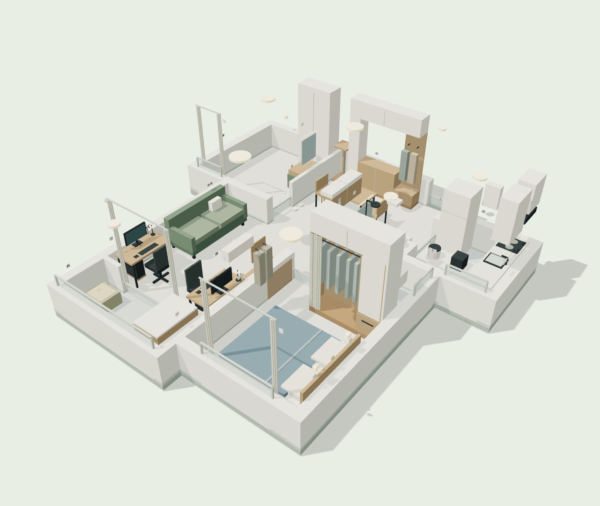

# 天成美雅 · Three.js 独立新版 V7

日期：2026-10-08。依据仓库 `user_demand.md` 第 6 版（更新于 2026-10-07），从提交 `9ccca8e18e5130f42abfccd23710c540cb1a39ba` 的 v6 几何、物件清单和预算重建为真实 WebGL 三维页面。

本目录是新增版本，**没有替换** `布局/renovation-3d-v6.html`、原预算表或原需求文件。文件名称中的 V7 是此次互动页面的版本号，不表示用户重新确认了一版施工方案。



## 启动与查看

在本目录运行：

```sh
python3 serve.py --port 18770
```

打开 <http://127.0.0.1:18770/>。仅监听本机。也可以把本目录放到任意静态服务器，打开 `index.html`；Three.js 已放在 `vendor`，不依赖 CDN 和在线字体。不要直接双击 HTML（浏览器会限制模块与 JSON 加载）。

- 鼠标拖动旋转，滚轮缩放，右键平移；触屏可拖动和双指缩放。
- 房间按钮支持全屋及六个空间，点击模型或搜索清单中的物件看规划价、尺寸与安装条件。
- 进场分为“软装进场前”“入住前必需”“全部规划”；后补设备在第三阶段出现。
- 墙体完整 / 半墙 / 隐藏；顶面隐藏 / 透明 / 抬起 / 完整；支持夜间灯光、插座点位编号和清扫参考路线。
- 主卧床长 2m / 2.1m、床头左右、门外 / 室内洗漱均可比较。选室内洗漱时门改外侧移门，实际门价和水路待重报。
- 八处扩充吊柜与预算同步；其他预算勾选仅调整采购金额，不改进场模型。
- 48 项预算可改金额、勾选纳入、导出 CSV；修改保存在本浏览器，恢复基准可一键撤回。共享工程价不可按物件重复相加。
- “保存图片”导出当前模型 PNG；使用附带本地服务器时同一张图也写入 `previews/`。静态服务器无须保存端点。

## 新需求落地情况

| 要求 | 本版表达 |
| --- | --- |
| 两人一猫、80㎡旧房全拆重做 | 延用第 6 版户型；仅后加客厅隔间作为拆除目标，半墙显示不代表实际拆墙 |
| 两个单屏工位靠客厅窗 | 阳台前左右两侧各 120×60cm；58cm 占位椅收近后中间约 82cm |
| 固定餐桌和入口收纳 | 餐桌 120×70cm，入口 214×42×270cm，鞋柜/外套/杂物分开 |
| 主卧双人床与衣物分类 | 180×210cm 床垫优先试排，窄床架184×218cm；床头左右、床长可切换；干净/可复穿/待洗分开 |
| 次卧梳妆与低频留宿 | 右墙80×40cm梳妆台，110cm储物柜；100×200cm客床仅为后补占位 |
| 蹲便、开放淋浴、独立洗漱 | 默认门外70×45cm；室内55×40cm为互斥备选；不设淋浴玻璃隔断 |
| 门上音箱与路由设备柜 | 门外两只55×30×40cm、底2.2m、开放前脸与侧格栅；必需项900元，不混入八处可选吊柜 |
| 洗碗机和矮基站后买 | 厨房南短柜双仓；机器人净56.4×55×79cm、无前门底板踢脚；接口提前确认 |
| 洗烘一体、猫区域 | 阳台右侧洗烘机、左侧猫砂；食水靠餐区、猫爬架靠入口 |
| 地砖与清洁 | 客餐厅与卧室地砖；床/沙发/主机托架底部16cm目标，固定柜封底封顶 |
| 灯、电、网与智能 | 16处灯、39电源面板、7组开关、5组网口16端口；手机语音方向、手动控制保留、窗帘先手拉 |
| 天花板 | 新增各房间顶面，灯具随抬顶查看；顶面预算归原墙顶或吊顶工程，不重复加价 |

老聊天的坐便器、次卧工位、木地板等与最新需求冲突，已按仓库更新。蒸烤一体机未在仓库这次基准设备中，未擅自挤占台面或增加费用；如继续保留，应另确认位置、散热和电源，并增补预算。

## 预算与购买顺序

| 阶段 | 项目费 | 应急金 | 需准备资金 |
| --- | ---: | ---: | ---: |
| 硬装施工 | 91,460 | 11,800 | 103,260 |
| 入住必需 | 26,340 | 0 | 26,340 |
| 入住后补 | 14,000 | 0 | 14,000 |
| 合计 | 131,800 | 11,800 | **143,600** |

入住前累计 **129,600元**。应急金按前两阶段项目费117,800元的10%向上取整到百元，计一次。八处扩充吊柜默认未纳入，勾选5,500元后应急金变为12,400元，总计149,700元。门外接口增量900元如全包水电已含，可取消纳入；此时总计142,600元。

原 `施工与进场三阶段_20261006.md` 表格仍有89,660元和11,600元的旧值。本版以最新48项明细重算为91,460元和11,800元，原文件保持未改，避免覆盖历史。

先复尺与锁接口，再做硬装、固定柜及照明；入住先采购床、主卧空调、冰箱、洗烘机和日常家具；后补客厅空调、机器人、电视、洗碗机与客床。冬夏入住时客厅空调可前移。洗碗机与基站虽然晚买，**安装图必须早于橱柜下单**。

## 价格来源与限制

全部48项都有规划金额、预留区间、包含范围和备注，**没有把这些金额标成商家报价**。2026-10-08只取得三条可明确对应商品的网上价格参照：

- [IKEA LAGKAPTEN / OLOV 120×60cm](https://www.ikea.cn/cn/zh/p/lagkapten-la-ge-kai-pu-olov-ao-le-fu-shu-zhuo-fang-bai-se-xiang-mu-wen-hei-se-s59416907/) 页面329元/张，两张658元。页面提示缺货，且厂家明确不适合屏幕支架；仅作价格参照。
- [IKEA VIHALS 白色餐椅](https://www.ikea.cn/cn/zh/p/vihals-wei-ha-si-yi-zi-bai-se-80592734/) 页面99.99元/把，两把199.98元，不含桌；页面提示缺货，外尺寸与模型占位不同。
- [Xiaomi AX3000T](https://www.mi.com/shop/buy/detail?product_id=19106) 对应商品页的商城导航展示159元/台。未确认柜内天线、接线、散热和覆盖，未定购。

其余项目显示“待询价 · 未核验同规格网价”。定制柜与施工按工程量询价，家电必须先选定能装下的规格。小米商城部分导航跳转商品不一致，没有采用无法对应型号的价格。参考价均不含未明确的配送、安装、补贴条件；采购时复核。结构化记录见 `sources.json`。

## 校验与工程边界

```sh
node verify.mjs
```

校验48项合计与应急金、三阶段显隐、144物件编号和预算关联、2种洗漱位置、4种床长/方向组合、点位数量、顶柜纳入、三角面有效性和凹多边形地面面积。已在浏览器查看实际WebGL画面，验证房间切换、顶面、预算联动、物件清单与图片保存。

净高暂按2.7m；厨卫实际降顶需核排风、管线、灯具与柜顶，模型不是完成的吊顶施工图。夜间灯光是显示效果，不代表照度计算。清扫路线沿用v6数据，门全开、门槛同高、椅子收近等假设未被现场验证；本版没有宣称重新做过全屋碰撞求解。图上各房间面积合计54.40㎡，不等同于已核实的套内面积或铺贴工程量。

尺寸、墙体固定、梁位、窗门防猫、蹲便排污、防水排水、电路负荷和燃气安装仍需现场复核，使用原仓库23项硬装前置清单交底。预算表不含独立的未定蒸烤一体机、游戏主机和电脑硬件。

`vendor` 使用 Three.js 0.180.0，许可证见 `vendor/LICENSE`。v6 几何来源保留在 `model.js` 文件头。
