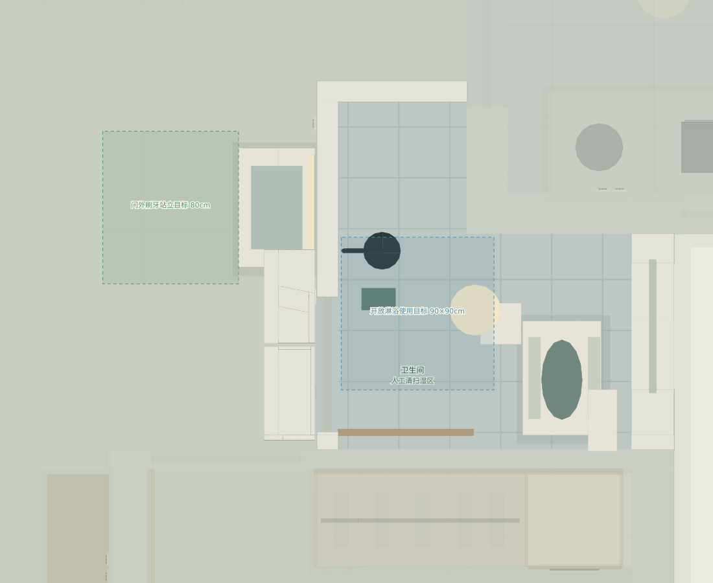
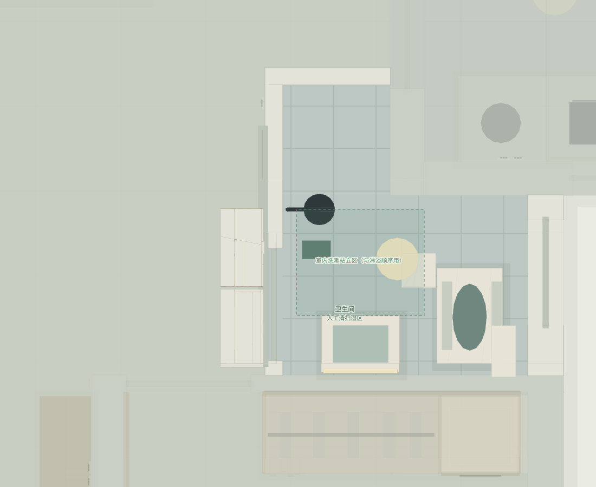
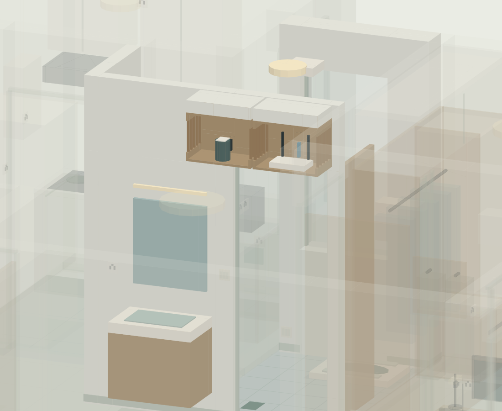

# 卫生间两方案与门上透气设备柜

2026-10-07，第6版。三维HTML的“洗漱位置比较”可以切换两方案；“完整墙体／半墙／隐藏墙体”均保留。默认半墙，完整墙补齐门洞上方墙体，便于观察柜体和门头。

## A 门外独立洗漱（初步建议）

70cm宽、45cm深的悬空洗漱柜设在卫生间门外邻墙，沿墙上方一段；刷牙面向墙，台前向客厅留80cm站立目标，与进门区域错开。柜底22cm，管线后置；台面完成高先按85cm，两人现场试用后确定。盆、柜、镜只计一套，梳妆台仍在次卧。

室内右侧蹲便保留，左侧开放淋浴改向中段墙，图面留90×90cm淋浴使用目标。不做淋浴隔断，湿区仍人工清扫。模型没有确认原排污口，也没有确定蹲便安装深度，不能按占位自行改排污或开挖楼板。

硬装先核门外墙段、动线、给水、排水坡度与存水弯、悬挂基层和局部防溅处理。排水不能凭图面保证可接；若现场不成立，再评估B或调整。

## B 室内南墙侧放（备选）

洗漱柜改55cm宽、40cm深，放室内南墙，刷牙面向南墙、站在左前方，柜前75cm为目标。它避开蹲便盆体，但仍共用开放淋浴湿区，洗漱和淋浴顺序使用。对188cm/100kg使用者，身体转身与肘部活动要现场试站，不能仅靠矩形占位认定舒适。

这个位置会被原内开门扫到，因此模型同时改为**门外侧上吊移门**，开门时滑向原A洗漱墙段；A洗漱台不同时保留。先核轨道长度、门头安装、私密/密封、门外走道和上柜，门价差额随公司重报价。模型预算仍按A一次计算，不把两套方案叠加。

| 比较 | A 门外洗漱 | B 室内南墙 |
| --- | --- | --- |
| 刷牙站立区 | 门外干区，与蹲便分开 | 便器左前方，避盆体；仍在湿区 |
| 洗漱柜 | 70×45cm | 55×40cm |
| 卫生间门 | 保留示意内开方式 | 必须改外侧移门并复核轨道 |
| 施工关键 | 新增门外给排水、局部防溅 | 门改动、柜前实际活动空间 |
| 初步选择 | 默认建议，排水和动线待实测 | 给排水外置不成立时再评估 |

## 门外上方两透气柜

两个独立柜沿卫生间门外侧墙安排，音箱仓和Wi-Fi仓各55cm宽×30cm深×40cm高，中间约2cm；柜底离地220cm，柜顶260cm另10cm收口到约270cm。墙体和门洞高度是图面假设，柜体必须固定于可靠墙体/基层，不能固定在装饰吊顶。

**两柜正面朝客厅敞开，侧面做木格栅和通风开口**，顶部封板上方收口，通风路径继续开放。音箱不被实心柜门挡住；路由器非金属仓、天线直立。可见设备是尺寸占位，不代表已选品牌型号，也不保证所有机型能装进净51.4×26.4×36.4cm柜内。下单柜体前按机身、天线展开、插头线缆弯曲与厂家散热要求核尺寸，装好试语音唤醒、温度和全屋信号。

| 接口 | 规划 | 预算口径 |
| --- | --- | --- |
| D-P1 | 音箱柜内独立插座，中心约234cm | 新增接口增量项 |
| D-P2 | Wi-Fi柜内独立插座，中心约234cm | 新增接口增量项 |
| N-D | 2条Cat6至入户，WAN/LAN两端口，约244cm | 新增接口增量项 |
| N-E | 入户8端口汇集，6条至双工位/电视＋2条至门上路由器 | 分组示意；模块、光猫、交换机及运营商拓扑核定 |

强弱电各走可维护路线，柜内设备可抽出，插座和线口能检修。N-E的8端口是汇集组，不是一只86盒安装8个网口。光猫/交换机是否运营商提供、真实数量与采购差价待核。

## 阶段与费用

双柜900元硬装必需；门外洗漱及设备柜接口增量900元先作询价预留。若公司10500元全屋水电报价已经完整包含新增接口，在Excel把增量行“纳入”改0即可扣除。音箱250、路由器450、网关/智能升级500仍在原1200元设备项目内，只计一次。八处扩充吊柜5500元继续可选，独立于这两个必需设备柜。

| 阶段 | 项目规划 | 资金规划 |
| --- | ---: | ---: |
| 1 硬装施工 | 91460 | 103260（含应急金11800） |
| 2 入住必需 | 26340 | 26340 |
| 3 入住后补 | 14000 | 14000 |

入住前资金129600元，完整规划143600元。所有金额是未询价预留，两方案替换时按公司范围调整，不购买两套洗漱柜。

## 放置与活动空间依据

[JGJ 367-2015第4.7节及条文说明](https://gf.cabr-fire.com/m/article-63613.htm)用于参考设备布局与人体活动空间，图面尺寸不是现场施工合规核定。

[小米官方路由器放置建议](https://www.mi.com/hk/support/faq/details/KA-502848/)倾向住宅中间、较高、无遮挡处，并提醒避免封闭金属箱和受阻柜位。据此采用门外开放木质仓；是否适合最终路由器和全屋覆盖仍需实测。音箱开放仓为本方案设计判断，按所选设备说明书和实机效果核对。
