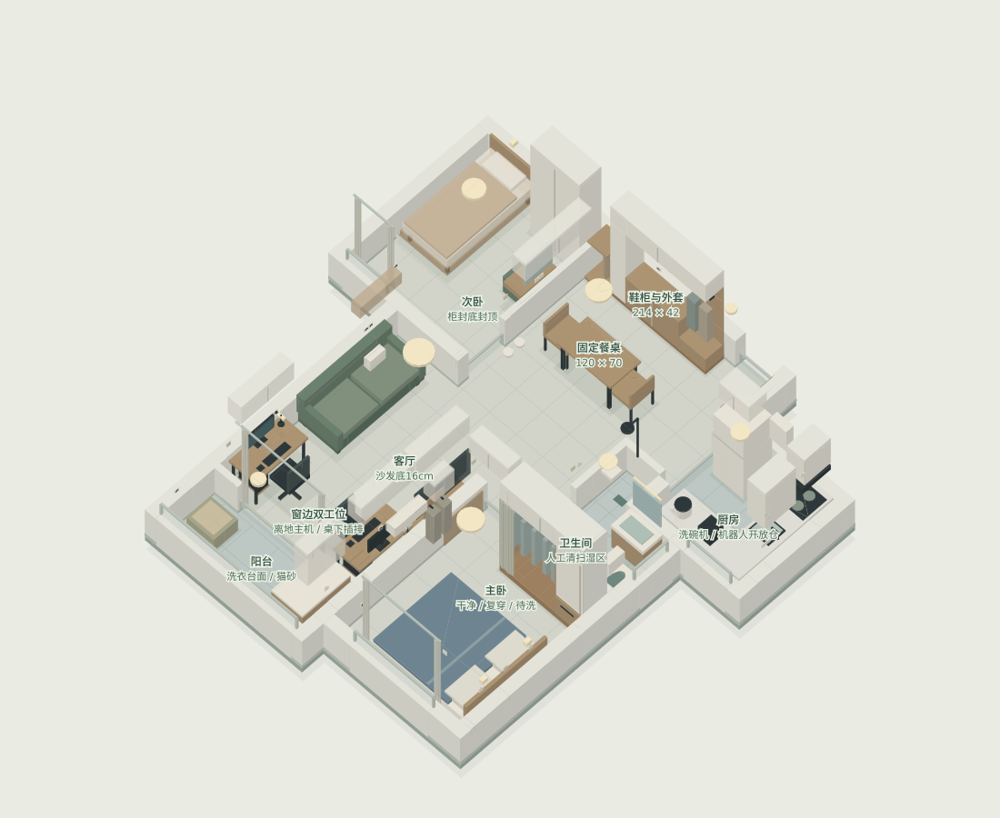

# 三维布局方案

2026-10-07，第5版。下载[renovation-3d-v5.html](renovation-3d-v5.html)，用浏览器打开。文件内含模型、价格信息、硬装清单和两张进场静态图，不需要网络加载。GitHub文件页显示源码；原中文、fixed和v4文件名均同步当前版本。

## 本次调整

梳妆台改到次卧右墙80×40cm独立角落，台前至客床98.5cm，底66cm；凳可收近，镜灯与插座一起迁移。卫生间保留悬空洗漱柜、蹲便和开放淋浴，主卧保留床与三类衣物收纳。

机器人移厨房南短柜右侧开放仓，左侧洗碗机仓；仓地面通铺、无柜门底板踢脚板，水电放相邻检修柜。机器人仓净56.4×55×79cm、前153cm，需选能入柜的矮基站，不能保证任意型号可用。洗碗机仓宽60cm、深约60、高约79，不设背板，开口和门叶按选机安装图核对。

两张120×60单屏桌仍靠阳台两侧，主机底16cm、桌下插排线槽；固定餐桌120×70，入口214cm鞋衣杂物组合；主卧床垫180×210、床架184×218，床头图面右墙、脚边63cm，200cm床长则73cm。床沙发最低梁16cm、电视柜18cm，入口主卧次卧柜落地到顶；八处扩充上柜约7.96延米另列可选5500元。

## 操作与信息

- 点击模型物件显示名称、规划价格、尺寸、阶段、安装注意和所属预算项。共136项；可用下方搜索列表定位被遮挡的小物件。零件归所属采购组合，面板、台灯等独立计价，已有物品和电脑排除明确显示。
- “软装进场前”显示固定安装和预留；“入住前必需”加入必要家具、家电、手拉窗帘和生活用品；“全部规划”加后补设备与备选吊柜。物件实体真实变化，不只是标签切换。
- 可切三维/俯视、墙体整高/剖切/隐藏、尺寸、后补、顶柜、灯具、灯电、点位编号及机器人路线；可比较两种床长和床头。拖动旋转、滚轮缩放，手机单指旋转/双指缩放。
- “定位次卧梳妆台”“定位厨房机器人仓”显示适合观察的相机角度；选择被隐藏物件会启用相应阶段与显示选项。
- 静态HTML也可看全屋SVG、两个阶段截图、点位和硬装清单；脚本被禁用时交互控件保持禁用，下载后浏览器打开启用。

价格为预算分摊，不应逐个几何面求和：砖墙门窗可见部件显示的是共享项目价；已有、已含或暂不计的物件不重复收费。基准含一次应急金141,600元，八处扩充吊柜未计。参见[物件清单](物件与预算清单_20261006.md)。

## 验证与图面限制

已核房间长宽、家具边界、门扇扫掠、预期桌椅与台凳收入关系、柜高、两单屏、39组灯电点位和16灯。两床头×两床长×七视角28处床面遮挡样本通过；脚本测试价格卡、选择捕获、阶段几何增减、俯视与窄屏等状态。阶段截图来自实际模型渲染。未做现场复尺或真实浏览器人工验收。

机器人按38cm直径/14cm高，通路45cm、最低梁16cm预留，在1cm网格从厨房新起点验四组各10条干区路径。门完全打开、椅子收近、门槛可过为假设；开放湿区人工清扫，路线不是导航或全覆盖承诺。

尺寸来自[原图](../用户提供/带尺寸户型图.jpg)与[尺寸抄录](../户型尺寸.json)：主卧2.83×3.37、次卧2.55×3.14、厨房2.06×2.15、阳台3.05×1.09m；凹角浴室约2.79㎡，客厅模型25.91㎡对图标25.6㎡。标注54.4㎡不是实测套内。净高2.7m用户自述，墙厚12～25cm、门80～88cm和窗台均为假设，朝向未知。结构、蹲便安装深度、阈高防水排水、衣物量、床承重、墙柜固定、窗帘与设备运行检修包络均由现场复核。
